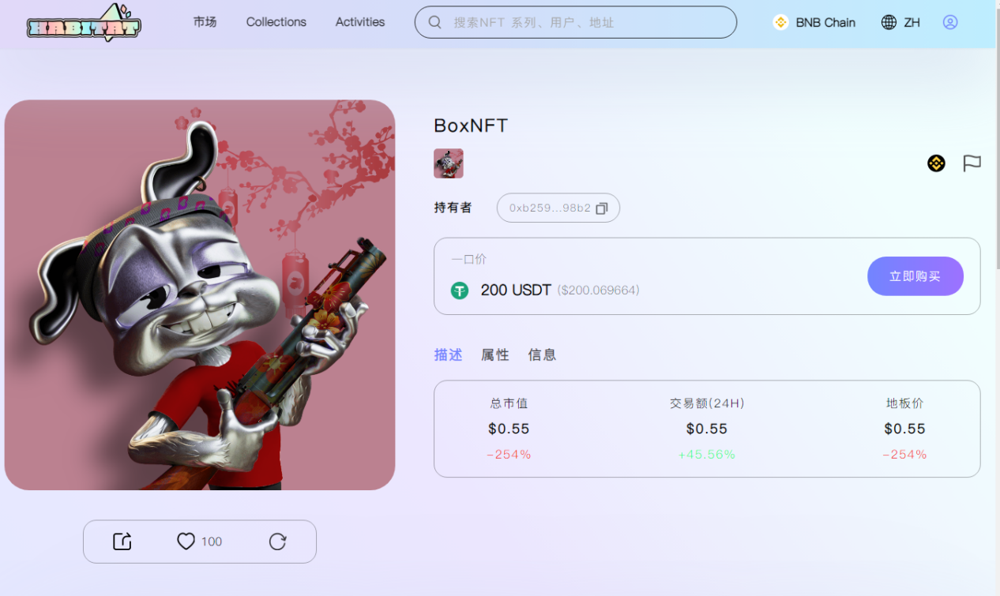

让我们来看看如何购买 NFT。
1. 连接您的加密钱包
如果您尚未连接并设置您的加密钱包，系统将提示您在此步骤中进行此操作。
2. 购买
在一个固定价格上市的 NFT 的详情页面上，你可以看到固定价格出售，以及一个购买按钮。

要购买 NFT，请单击“购买”按钮，您将看到一个确认弹出窗口。点击弹出窗口中的确认按钮，然后您的钱包会提示您确认转账/付款。
确认付款后，页面上应显示一个确认对话框，指示购买已完成并且 NFT 已转移给您。您可以点击交易ID查看链上实际交易，或者访问您的个人中心页面查看您刚刚获得的NFT。

